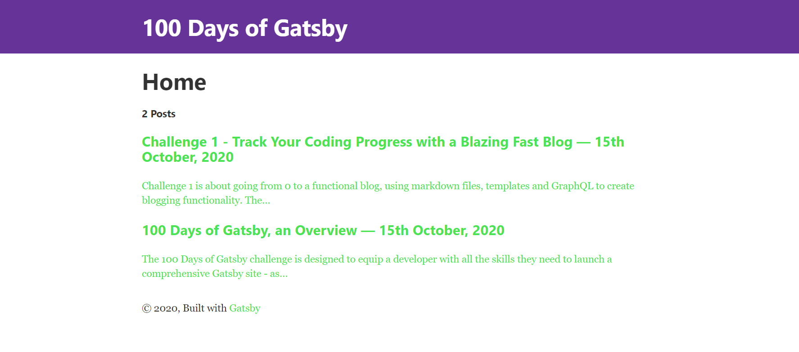
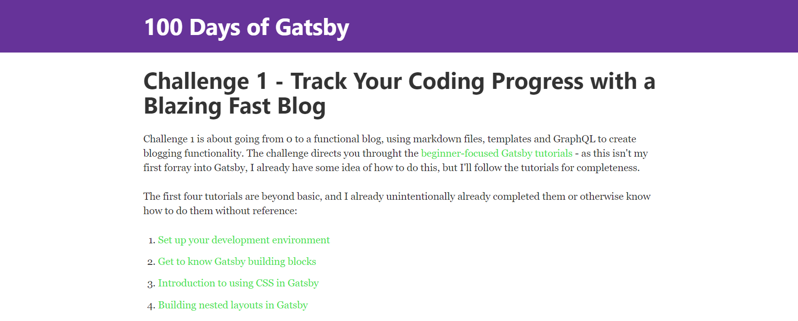
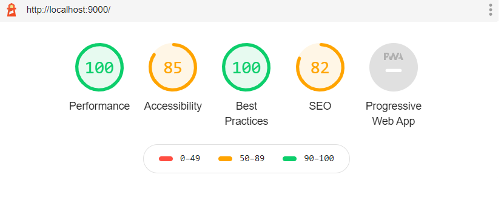

Challenge 1 is about going from 0 to a functional blog, using markdown files, templates and GraphQL to create blogging functionality. The challenge directs you throught the [beginner-focused Gatsby tutorials](https://www.gatsbyjs.com/tutorial/) - as this isn't my first forray into Gatsby, I already have some idea of how to do this, but I'll follow the tutorials for completeness.

The first four tutorials are beyond basic, and I already unintentionally already completed them or otherwise know how to do them without reference:

1. [Set up your development environment](https://www.gatsbyjs.com/tutorial/part-zero/)
2. [Get to know Gatsby building blocks](https://www.gatsbyjs.com/tutorial/part-one/)
3. [Introduction to using CSS in Gatsby](https://www.gatsbyjs.com/tutorial/part-two/)
4. [Building nested layouts in Gatsby](https://www.gatsbyjs.com/tutorial/part-three/)

The next tutorials are where the Gatsby challenge actually begins:

4. [Querying for data in a blog](https://www.gatsbyjs.com/tutorial/part-four/)
5. [Source plugins and rendering queried data](https://www.gatsbyjs.com/tutorial/part-five/)
6. [Transformer plugins](https://www.gatsbyjs.com/tutorial/part-six/)
7. [Programatically create pages from data](https://www.gatsbyjs.com/tutorial/part-seven/)
8. [Preparing a site to go live](https://www.gatsbyjs.com/tutorial/part-eight/)

### Creating the Blogging Functionality

Note: This blog post will only explore what is required to complete the challenge.

Second Note: I appreciate how Ugly the gatsby site is in these screenshots, and I hope you do too!

Firstly, we install the plugins we need:

```terminal
npm install gatsby-transformer-remark gatsby-remark-images
```

And then we add the relevent information to the gatsby-config.js file:

```javascript
module.exports = {
  siteMetadata: {
    title: `100 Days of Gatsby`,
    description: `A 100 Days of Gatsby Challenge blog.`,
    author: `@securatom`,
  },
  plugins: [
    `gatsby-plugin-react-helmet`,
    {
      resolve: `gatsby-source-filesystem`,
      options: {
        name: `src`,
        path: `${__dirname}/src`,
      },
    },
    {
      resolve: `gatsby-source-filesystem`,
      options: {
        path: `${__dirname}/src/images`,
      },
    },
    {
      resolve: `gatsby-transformer-remark`,
      options: {
        plugins: [
          {
            resolve: `gatsby-remark-images`,
            options: {
              maxWidth: 800,
            },
          },
        ],
      },
    },
    `gatsby-transformer-sharp`,
    `gatsby-plugin-sharp`,
    {
      resolve: `gatsby-plugin-manifest`,
      options: {
        name: `gatsby-starter-default`,
        short_name: `starter`,
        start_url: `/`,
        background_color: `#663399`,
        theme_color: `#663399`,
        display: `minimal-ui`,
        icon: `src/images/gatsby-icon.png`, // This path is relative to the root of the site.
      },
    },
  ],
}

```

We want to be able to access all of our blog posts from our index page, we're going to do this through using a GraphQL query to grab our markdown files and to display the title, date, author, and excerpt.

Our index.js file is left looking like this:

```javascript
import React from "react"
import { graphql, Link } from "gatsby"
import Layout from "../components/layout"

export default function IndexPage({ data }) {
  console.log(data)
  return (
    <Layout>
      <div>
        <h1>
          Home
        </h1>
        <h4>{data.allMarkdownRemark.totalCount} Posts</h4>
        {data.allMarkdownRemark.edges.map(({ node }) => (
          <div key={node.id}>
            <Link to={node.fields.slug}>
            <h3>
              {node.frontmatter.title}{" "}
              <span>
                — {node.frontmatter.date}
              </span>
            </h3>
            <p>{node.excerpt}</p>
            </Link>
          </div>
        ))}
      </div>
    </Layout>
  )
}

export const query = graphql`
  query {
    allMarkdownRemark
    (sort: { fields: [frontmatter___date], order: DESC })
    {
      totalCount
      edges {
        node {
          id
          frontmatter {
            title
            date(formatString: "Do MMMM, YYYY")
            author
          }
          fields {
            slug
          }
          excerpt
        }
      }
    }
  }
`
```

Our rather ugly (for now) index page looks like this - the horrific and temporary green font indicates a hyperlink:



Now that we have a crude index page, we need to add the functionality to create pages for each blog post. Add the following to the gatsby-node.js file:

```javascript
const { createFilePath } = require(`gatsby-source-filesystem`)

exports.onCreateNode = ({ node, getNode, actions }) => {
  const { createNodeField } = actions
  if (node.internal.type === `MarkdownRemark`) {
    const slug = createFilePath({ node, getNode, basePath: `pages` })
    createNodeField({
      node,
      name: `slug`,
      value: slug,
    })
  }
}
```

Now that a page is generated for each markdown file in the folder 'posts', we can click on the hyperlinks and look at each page - writing this one live, it looks like this:



### Preparing to Go Live

Gatsby's final 'beginner tutorial' is to prepare the site to go live. Their first recommendation is to audit with lighthouse.

"Lighthouse is an open-source, automated tool for improving the quality of web pages. You can run it against any web page, public or requiring authentication. It has audits for performance, accessibility, progressive web apps (PWAs), and more." - [The Lighthouse Website](https://developers.google.com/web/tools/lighthouse/)

To do so, we need to move to a production build, rather than operating on the development server. To do so we halt our development server and run the following commands and opening ```localhost:9000```:

```terminal
gatsby build
gatsby serve
```

After we've opened ```localhost:9000``` in Chrome and navigated our way to DevTools > Lighthouse, we click 'Perform an audit...' - doing so gives the following, perhaps unsurprising, output:



There's things we can do to immediately improve these metrics, but we're going to leave it there for challenge 1, as some of the next recommendations in the [keep making it better](https://www.gatsbyjs.com/tutorial/part-eight/#keep-making-it-better) section of tutorial 8 are covered more in the later challenges.
